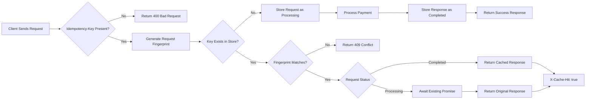
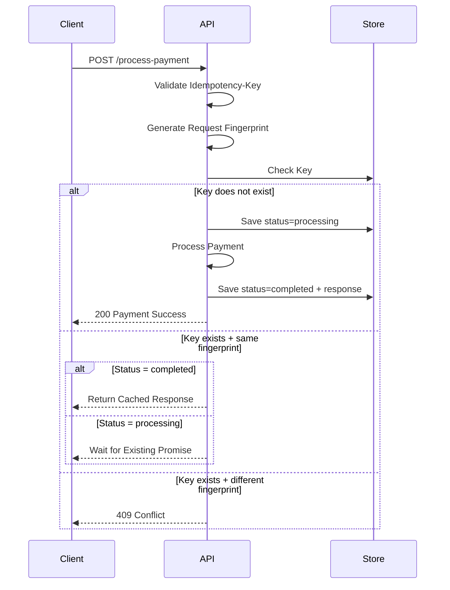

# Idempotency-Gateway (The "Pay-Once" Protocol)
A lightweight Express + TypeScript API that demonstrates idempotent payment processing. The service ensures that duplicate payment requests with the same idempotency key are processed only once, while subsequent retries return the previously stored response.

## 1. Architecture Diagram
The diagrams below illustrate the request lifecycle and interaction between the client, API layer, and idempotency store.
### flowchart

#### Request Flow


#### sequence diagram




## 2. Stetup instructions
#### prerequisites
`node.js 18+`
 `npm`

#### clone repo
```bash
git clone "https://github.com/Jake-Ab/Idempotency-Gateway.git"

cd Idempotency-Gateway
```


#### install dependencies
```bash
npm install
```

#### start server
```bash
npm run dev
```

the development server will start on:
`http://localhost:3000`

## 3. api documentation
### health check

#### request
`GET /`


#### response
`api running`


### process payment

##### request

`POST /process-payment`

###### request sample
```bash
curl -i -X POST \
http://localhost:3000/process-payment \
-H "Content-Type: application/json" \
-H "Idempotency-Key: abc123" \
-d '{"amount":100,"currency":"GHS"}'
```

#### Headers
   | Header | Required |
|---------|----------|
| Idempotency-Key | Yes |
| Content-Type: application/json | Yes |

        
#### Request Body
` {
"amount": 100,
 "currency": "GHS"
}`


### Successful Payment

#### Response
  `200 OK`
```json
{
 "message": "Charged 100 GHS"
 }
 ```


### Duplicate Request

When the same idempotency key and request body are submitted again:

#### Response
`200 OK`

##### Headers:

`X-Cache-Hit: true`

```json
{
  "message": "Charged 100 GHS"
}
```

The original response is returned without reprocessing the payment.

## Idempotency Key Reused With Different Payload
### Request

#### Same key, different request body.
###### sample request
```bash
curl -i -X POST \
http://localhost:3000/process-payment \
-H "Content-Type: application/json" \
-H "Idempotency-Key: abc123" \
-d '{"amount":500,"currency":"GHS"}'
```

#### Response
`409 Conflict`

`{
  "error": "Idempotency key already used for different request body."
}`

### Missing Idempotency Key
###### sample request
```bash
curl -i -X POST \
http://localhost:3000/process-payment \
-H "Content-Type: application/json" \
-d '{"amount":100,"currency":"GHS"}'
```
### Response
`400 Bad Request`

`{
  "error": "Idempotency key header required!"
}`

### Internal Processing Failure
#### Response
`500 Internal Server Error`

`{
  "error": "Payment processing failed"
}`


## 4. Design Decisions
### i. In-Memory Storage

 JavaScript Map was used as the idempotency store.

##### Advantages:

- Simple implementation
- Fast lookups
- No external dependencies
- Easy to understand and evaluate

##### Trade-off:

- Data is lost when the application restarts.
- Not suitable for distributed deployments.

> In production, a shared datastore such as Redis would be preferred.

### ii. Request Fingerprinting

Each request body is hashed using SHA-256 to create a fingerprint.

##### Purpose:

- Detect attempts to reuse an idempotency key with different payloads.
- Avoid storing entire request bodies for comparison.
- Provide efficient and deterministic request matching.


### iii. In-Flight Request Handling

A common edge case occurs when a duplicate request arrives while the original request is still being processed.

To handle this, the implementation stores the active Promise associated with the request.

When another request with the same key and fingerprint arrives:

The existing Promise is awaited.
No second payment processing operation is started.
Both clients receive the same result.

This prevents duplicate execution under concurrent requests.

### iv. Error Handling

Payment processing is wrapped in a try/catch block.

##### If processing fails:

- The idempotency record is removed from the store.
- A 500 response is returned.
- The client can safely retry using the same idempotency key.

This prevents failed requests from remaining permanently stuck in the processing state.

### v. project structure

```text
src/
│
├── server.ts
├── routes/
│   └── payment.ts
├── services/
│   └── paymentService.ts
├── store/
│   └── idempotencyStore.ts
├── types/
│   └── payment.ts
└── utils/
    └── fingerprint.ts
```

## 5. Developer's Choice
For the Developer's Choice requirement, I implemented automatic expiration of idempotency records using a Time-To-Live (TTL) mechanism.
### Automatic Idempotency Record Expiration (TTL)

To prevent unbounded memory growth, a Time-To-Live (TTL) cleanup mechanism was added.

##### Implementation:

- Each record stores a creation timestamp.
- A background cleanup process periodically removes expired entries.
- Records older than 24 hours are deleted automatically.

##### Benefits:

- Prevents memory leaks in long-running processes.
- Mirrors the behavior of real-world payment systems where idempotency records are retained only for a limited duration.
- Keeps the in-memory store efficient over time.


## Future Improvements

If this were extended beyond the scope of the challenge, the next improvements would be:

- Redis-backed distributed idempotency store
- Request validation and rate limiting middleware
- Persistent response storage
- Automated integration tests using Jest and Supertest
- Structured logging and monitoring
- Configurable TTL policies


## Conclusion

this project demonstrates a simple idempotency gateway built with Express and TypeScript. It ensures that duplicate payment requests are processed only once, prevents idempotency key misuse, and safely handles concurrent requests.

this implementation focuses on building a system that is correct, has simple approach, and can be maintained. it provides a foundation that can be extended for production use with persistent storage and automated testing.
